# tokendiet

A Claude Code statusline that shows what your session is actually costing —
and tells you when to `/clear`.

The diet is on **context**, not on your prose. Shorter answers save almost
nothing; long sessions are what get expensive. See [Why](#why-context-and-not-verbosity),
or the short version at **[mcancellotti.github.io/tokendiet](https://mcancellotti.github.io/tokendiet)**.



In plain text, the three states:

```
Opus 5 · ~/myproject · main* · ░░░░░░░░░░ 40K/1.0M · $0.62
Opus 5 · ~/myproject · main* · █░░░░░░░░░ 185K/1.0M · $3.42 · ◐ /clear when this task ends
Opus 5 · ~/myproject · main* · ██████░░░░ 620K/1.0M · $18.40 · ⚠ /clear
```

Green under 150K tokens, yellow past it, red past 350K. Model, working
directory, git branch (`*` when dirty), context bar, live session cost.

## What the turn you just took cost

The second line reports the turn that has just finished, and sets it against
the first turn of the session:

```
Opus 5 · ~/myproject · main* · ██████░░░░ 620K/1.0M · $18.40 · ⚠ /clear
turn +160K · $1.40 · 6.7× vs first turn · 1h34m
```

None of that is modelled or estimated. A turn's cost is the difference between
two readings of the session total, and the multiplier is that figure against
the first turn that cost anything. It is this project's whole argument reduced
to one number, measured on your own session: the question you are about to ask
costs nearly seven times what the same question cost ninety minutes ago.

The multiplier appears once it passes 1.15x — below that it is noise, and a
line that prints `1.0×` every turn is a line people stop reading. It goes
yellow at 2x and red at 4x.

Set `TOKENDIET_TURN=0` to keep a single line.

## Install

```sh
git clone https://github.com/mcancellotti/tokendiet
cd tokendiet
python3 install.py     # on Windows: python install.py
```

The installer copies `tokendiet.py` into `~/.claude/` and sets the `statusLine`
block in `~/.claude/settings.json`, leaving every other setting untouched. Your
old `settings.json` is backed up next to it as `settings.json.bak`.

Start a new Claude Code session to see the bar.

To do it by hand instead, drop `tokendiet.py` anywhere and add:

```json
{
  "statusLine": {
    "type": "command",
    "command": "python3 ~/.claude/tokendiet.py",
    "padding": 0
  }
}
```

Requires Python 3.8+. No dependencies.

### Windows

`python install.py` works the same from `cmd` or PowerShell. If you'd rather
not clone the repo, fetch the script and wire it up by hand — from PowerShell:

```powershell
New-Item -ItemType Directory -Force "$env:USERPROFILE\.claude" | Out-Null
Invoke-WebRequest -UseBasicParsing https://raw.githubusercontent.com/mcancellotti/tokendiet/main/tokendiet.py -OutFile "$env:USERPROFILE\.claude\tokendiet.py"
```

Then add this to `%USERPROFILE%\.claude\settings.json`, with your own username
in the path:

```json
{
  "statusLine": {
    "type": "command",
    "command": "python C:/Users/YOU/.claude/tokendiet.py",
    "padding": 0
  }
}
```

Three Windows details worth knowing. That file is `settings.json` **inside**
the `.claude` folder — not the `.claude.json` sitting next to it, which holds
your MCP servers and is never checked for a statusline. Use `python` or `py`,
not `python3`: on Windows `python3` is usually the Microsoft Store alias, which
opens the Store rather than running anything. And write the path with forward
slashes — inside JSON a backslash starts an escape sequence, so `C:\Users\...`
would have to be doubled to survive.

## Why context, and not verbosity

Every turn re-sends the entire accumulated context. A session that has grown to
500K tokens pays for 500K tokens *on every single turn*, whether the reply is
three words or three pages. Cost grows quadratically with session length.

Measured across my own five largest sessions:

| | share of spend |
|---|---|
| cache reads | ~66% |
| cache writes | ~24% |
| output | ~10% |

And only about a quarter of that output was prose — the rest was tool calls. So
compressing how the model *writes* touches roughly 1.5% of the bill. Clearing
between unrelated tasks, and reading files narrowly instead of wholesale, is
worth orders of magnitude more. That is the diet this tool is named after.

## Why absolute thresholds, not a percentage

Most context meters show "% of window full". That number lies about cost. With
a 1M-token window, 500K used looks like a comfortable half tank — but it costs
2.5x what 200K costs, on every turn, until you clear.

So the colours key off absolute token counts: yellow at 150K, red at 350K. The
bar still fills proportionally to the window, because knowing how much room is
left is useful too — it just isn't what determines the bill.

## Why a statusline, and not a hook

A statusline is drawn by your terminal. It never enters the conversation, so it
costs **zero tokens**.

The alternative would be a `UserPromptSubmit` hook injecting a warning into the
context. That works, but it pays for the warning in input tokens on every
single turn — spending from exactly the budget it's trying to protect. And no
hook can run `/clear` or `/compact` for you: those are harness commands, not
things a hook or a skill can invoke. Whatever you build, a human has to make
the call. So the job is to put the number where a human will see it, as cheaply
as possible.

## Configuration

| Variable | Default | Meaning |
|---|---|---|
| `TOKENDIET_WARN` | `150000` | Tokens at which the bar turns yellow |
| `TOKENDIET_HIGH` | `350000` | Tokens at which it turns red |
| `TOKENDIET_TURN` | `1` | Set to `0` to drop the per-turn second line |
| `NO_COLOR` | unset | Set to anything to disable colour |

Set them in the `statusLine` command itself if you want them scoped to it:

```json
{ "type": "command", "command": "TOKENDIET_WARN=100000 python3 ~/.claude/tokendiet.py", "padding": 0 }
```

## How it reads the session

Claude Code pipes a JSON payload to the statusline command on stdin. tokendiet
takes `context_window.used_percentage` when it's there, and otherwise falls
back to summing this turn's `input_tokens`, `cache_creation_input_tokens` and
`cache_read_input_tokens` — cached or not, you pay for all three. Missing
fields are skipped rather than guessed, and malformed input prints nothing
instead of spraying a traceback across your terminal.

## Tests

```sh
python3 test_render.py -v
```

Renders sample payloads for each state — green, yellow, red, the fallback path,
custom thresholds, empty payloads, junk on stdin — and checks the output. No
test framework needed.

## Privacy

tokendiet makes no network calls and collects nothing. It reads the payload
Claude Code hands it, shells out to `git` for the branch name, and prints a
line.

The per-turn line needs to remember the previous turn, so it keeps one small
file per session — a running total and the last turn's delta — in your system
temp directory under `tokendiet/`, pruned after three days. Nothing leaves your
machine, and `TOKENDIET_TURN=0` stops it being written at all.

## License

MIT
